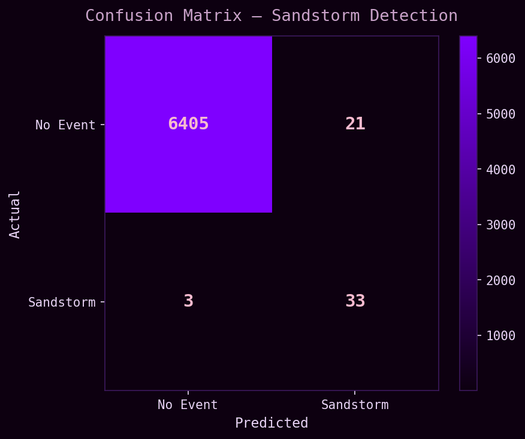
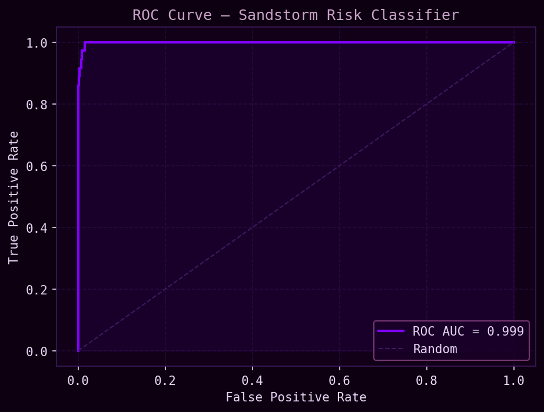
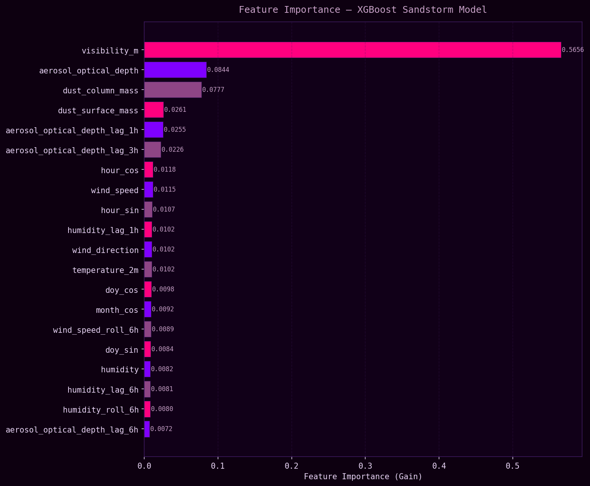

# UAE Sandstorm Prediction System

XGBoost classifier for probabilistic sandstorm risk prediction in the UAE using NASA MERRA-2 reanalysis data and NOAA Integrated Surface Database ground observations, with a Streamlit geospatial intelligence dashboard.


<p align="center">
  
</p>

<div align="center">

━━━━━━━━━━━━━━ ✦ ✧ ✦ ━━━━━━━━━━━━━━

</div>

## 🟣 Overview

This project implements a full machine learning pipeline for sandstorm risk prediction across the UAE, targeting aviation safety, infrastructure planning, and public health applications.

The system ingests NASA MERRA-2 hourly reanalysis data (wind, temperature, humidity, surface pressure, dust aerosol optical depth) and aligns it with NOAA ISD ground observations from Abu Dhabi International Airport (Station 41217) including measured visibility and recorded dust weather event codes. An XGBoost binary classifier is trained on engineered lag, rolling, and interaction features to produce a probabilistic risk score and categorical risk level (LOW / MEDIUM / HIGH) for each hourly timestep.

The pipeline is fully modular, end-to-end reproducible, and ships with a dark-themed Streamlit dashboard.

<br><br>

## 🟣 Key Features

- Probabilistic sandstorm risk scoring (0–1) with categorical output
- NASA MERRA-2 reanalysis ingestion (NetCDF and CSV support)
- NOAA ISD ground observation ingestion with real dust event weather codes
- Lag features (1h, 3h, 6h) and rolling window averages (3h, 6h, 12h)
- Humidity-pressure and AOD-wind interaction features
- Cyclical seasonal encoding (month, day-of-year, hour)
- Time-based train/test split with no data leakage
- Class imbalance handling via scale_pos_weight
- Full evaluation suite: Accuracy, Precision, Recall, F1, ROC-AUC
- Streamlit dashboard with purple geospatial intelligence theme
- Standalone inference module usable independently of training pipeline

<br><br>

## 📊 Model Evaluation
| Metric     | Value |
|------------|-------|
| Accuracy   | 0.9963 |
| Precision  | 0.61 (positive class) |
| Recall     | 0.92 (positive class) |
| F1-Score   | 0.7333 |
| ROC-AUC    | 0.9987 |
<br>

<p align="center">
  
  
  
</p>

<br><br>

## 🟣 Risk Level Interpretation

| Risk Score | Risk Level | Operational Meaning |
|-----------|------------|---------------------|
| 0.00 – 0.29 | LOW | No significant sandstorm risk |
| 0.30 – 0.59 | MEDIUM | Elevated dust activity possible |
| 0.60 – 1.00 | HIGH | Sandstorm event likely |

<br><br>

## 🟣 Data Sources

| Source | Product | Variables | Format |
|--------|---------|-----------|--------|
| NASA GES DISC | MERRA-2 M2T1NXSLV | U10M, V10M, T2M, QV2M, PS | NetCDF |
| NASA GES DISC | MERRA-2 M2T1NXAER | DUEXTTAU, DUSMASS, DUCMASS | NetCDF |
| NOAA NCEI | Integrated Surface Database (ISD) | Visibility, wind speed/direction, present weather codes | CSV |

**Spatial coverage:** UAE bounding box (22.5–26.5°N, 51.0–56.5°E)  
**Temporal coverage:** 2020-01-01 to 2023-12-31  
**Ground station:** Abu Dhabi International Airport (USAF ID: 41217099999)

NOAA ISD present weather codes used for sandstorm labeling:
- Code `06` — dust in suspension
- Code `07` — dust/sand raised by wind
- Code `09` — sandstorm / duststorm

<br><br>

## 🟣 System Architecture

```text
[NASA MERRA-2 NetCDF] ──┐
                         ├──► [Data Alignment] ──► [Feature Engineering] ──► [XGBoost Classifier]
[NOAA ISD CSV] ──────────┘                                                          │
                                                                                     ▼
                                                                     [Risk Score 0–1 + Risk Level]
                                                                                     │
                                                                                     ▼
                                                                         [Streamlit Dashboard]
```

<br><br>

## 🟣 Feature Pipeline

| Feature | Description |
|---------|-------------|
| `wind_speed` | Magnitude computed from U10M/V10M components |
| `wind_direction` | Meteorological degrees from U/V vectors |
| `wind_speed_lag_1h` | 1-hour lag |
| `wind_speed_lag_3h` | 3-hour lag |
| `wind_speed_lag_6h` | 6-hour lag |
| `wind_speed_roll_3h` | 3-hour rolling mean |
| `wind_speed_roll_6h` | 6-hour rolling mean |
| `wind_speed_roll_12h` | 12-hour rolling mean |
| `humidity_pressure_ratio` | QV2M / (PS / 1000) interaction |
| `aod_wind_interaction` | DUEXTTAU × wind speed |
| `month_sin / month_cos` | Cyclical month encoding |
| `doy_sin / doy_cos` | Cyclical day-of-year encoding |
| `hour_sin / hour_cos` | Cyclical hour encoding |

<br><br>

## 🟣 Labeling Strategy

Sandstorm events are labeled using **real recorded weather codes** from NOAA ISD rather than synthetic thresholds. Present weather codes 06, 07, and 09 (dust suspension, dust raised by wind, sandstorm/duststorm) are mapped directly to binary labels. This provides ground-truth event labels from an internationally recognized observational network.

The threshold-based fallback in `src/features/labeling.py` remains available for stations or periods where weather codes are absent.

<br><br>

## 🟣 Project Structure

```text
uae-sandstorm-prediction/
│
├── configs/
│   └── config.yaml
│
├── data/
│   ├── raw/
│   │   ├── merra2_daily/          ← daily NetCDF files from GES DISC
│   │   ├── merra2_aer_daily/      ← aerosol NetCDF files from GES DISC
│   │   ├── isd_2020.csv
│   │   ├── isd_2021.csv
│   │   ├── isd_2022.csv
│   │   └── isd_2023.csv
│   └── processed/
│       └── features.csv
│
├── src/
│   ├── data/
│   │   ├── merra2_loader.py
│   │   └── ncms_loader.py
│   ├── features/
│   │   ├── engineering.py
│   │   └── labeling.py
│   ├── model/
│   │   ├── train.py
│   │   └── inference.py
│   ├── visualization/
│   │   └── plots.py
│   └── utils/
│       └── helpers.py
│
├── scripts/
│   ├── merge_merra2.py
│   ├── preprocess_isd.py
│   ├── train.py
│   └── predict.py
│
├── dashboard/
│   └── app.py
│
├── notebooks/
│   └── exploration.ipynb
│
├── models/
│   └── sandstorm_xgb.pkl
│
├── reports/
│   ├── confusion_matrix.png
│   ├── roc_curve.png
│   └── feature_importance.png
│
├── tests/
│   ├── test_features.py
│   ├── test_model.py
│   └── test_data.py
│
├── requirements.txt
├── .gitignore
└── README.md
```

<br><br>

## 🟣 Technologies Used

- Python 3.10+
- XGBoost
- scikit-learn
- pandas
- numpy
- netCDF4
- scipy
- matplotlib
- seaborn
- Streamlit
- Plotly
- PyYAML
- joblib
- pytest

<br><br>

## 🟣 Setup Instructions

### 1. Clone Repository
```bash
git clone https://github.com/ktariqq/uae-sandstorm-prediction.git
cd uae-sandstorm-prediction
```

### 2. Install Dependencies
```bash
pip install -r requirements.txt
```

### 3. Acquire Data

**NASA MERRA-2 (requires free Earthdata account):**
- Register at https://urs.earthdata.nasa.gov/users/new
- Go to https://disc.gsfc.nasa.gov/ and search `M2T1NXSLV`
- Subset: variables U10M, V10M, T2M, QV2M, PS — UAE bounding box — 2020–2023
- Repeat for `M2T1NXAER`, selecting DUEXTTAU, DUSMASS, DUCMASS
- Download via wget using the provided URL list
- Place daily `.nc` files into `data/raw/merra2_daily/` and `data/raw/merra2_aer_daily/`

**NOAA ISD (no account required):**
- Go to https://www.ncei.noaa.gov/access/search/data-search/global-hourly
- Search station: Abu Dhabi International (41217099999)
- Download CSV for each year 2020–2023
- Save as `data/raw/isd_2020.csv` through `isd_2023.csv`

### 4. Preprocess Data
```bash
# Merge MERRA-2 daily NetCDF files into single CSV
python scripts/merge_merra2.py

# Preprocess and merge NOAA ISD files
python scripts/preprocess_isd.py
```

### 5. Train Model
```bash
python scripts/train.py
```

### 6. Run Inference
```bash
# Batch inference
python scripts/predict.py --input data/processed/features.csv

# Manual single-observation mode
python scripts/predict.py --single
```

### 7. Launch Dashboard
```bash
streamlit run dashboard/app.py
```

### 8. Run Tests
```bash
pytest tests/ -v
```

<br><br>

## 🟣 Evaluation Outputs

Training automatically generates:

- Confusion matrix — `reports/confusion_matrix.png`
- ROC curve — `reports/roc_curve.png`
- Feature importance plot — `reports/feature_importance.png`
- Classification report — printed to terminal

<br><br>

## 🟣 Future Directions

- Extend coverage to Dubai and Al Ain stations for multi-site prediction
- Incorporate MODIS satellite imagery for spatial risk mapping
- Add 6-hour and 12-hour forecast horizon outputs
- Deploy as REST API for integration with UAE aviation systems
- Incorporate real-time MERRA-2 NRT (near-real-time) data feeds

<br><br>

## 🟣 Author

Kommal Tariq  
AI/ML Systems · Geospatial Intelligence · Environmental Risk Modeling
